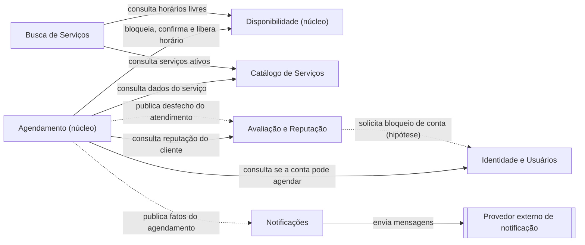
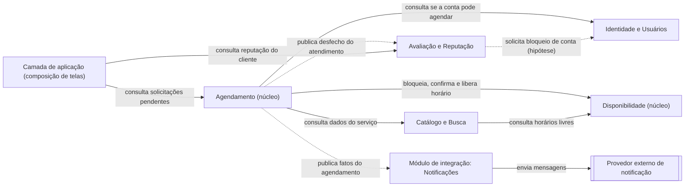
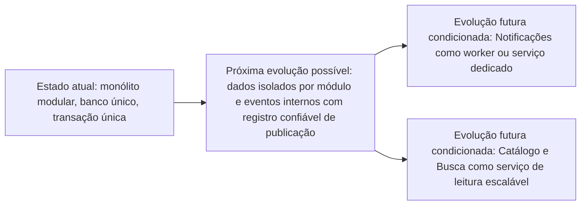

# Do Domínio às Fronteiras: Organizando a Arquitetura do Sistema

## Parte 1 — Retomada do domínio

### 1.1 Síntese do sistema

| Item | Síntese |
| :--- | :--- |
| **Problema central** | Pequenos e médios prestadores controlam horários por caderno, WhatsApp e agendas manuais. Isso gera conflitos de horário, esquecimentos, *no-shows* e ausência de histórico de reputação compartilhado entre prestadores. |
| **Principais atores** | **Usuário**, que assume o papel de **Cliente** (busca e reserva) ou de **Prestador** (oferta serviços e atende); **Administrador** (moderação); **Serviço de Notificação** (externo). |
| **Principais fluxos** | (1) O Prestador cadastra serviços e disponibilidade. (2) O Cliente busca serviços. (3) O Cliente solicita o agendamento, que fica Pendente. (4) O Prestador aprova ou recusa, ou a solicitação expira. (5) O atendimento é realizado. (6) Ambos fazem a avaliação mútua. |
| **Conceitos centrais** | Usuário (Entidade); Agendamento (Entidade, root); Serviço, Janela de Tempo e Avaliação (Objetos de Valor); Status do Agendamento; Política de Timeout; Catálogo (visão agregada, baixa certeza). |
| **Regras e invariantes** | **RN01:** antecedência mínima de 24h. **RN02:** expira se o Prestador não aprovar até 10h antes do início. **RN03:** um Cliente não pode ter mais de um agendamento ativo na mesma data. **RN04:** avaliação bidimensional (Serviço e Atendimento). **INV-1:** reservas Pendente/Confirmado do mesmo Prestador nunca têm Janelas de Tempo sobrepostas. **INV-2:** só existe Avaliação se o Agendamento estiver Concluído ou Não Compareceu. **INV-3:** timeout (10h) menor que a antecedência (24h). **RN05 (nova):** o mesmo Usuário não pode ser Cliente e Prestador no mesmo Agendamento. **RN06 (nova, hipótese):** o Usuário tem uma agenda única, então não pode prestar e receber serviço em horários sobrepostos. |
| **Agregados identificados** | **Agendamento** (root), com Serviço (fotografia imutável), Prestador, Cliente, Janela de Tempo e Status. A Avaliação se relaciona ao Agendamento (1 : 0..2), mas o agregado que a contém ainda não estava definido; esta etapa propõe o agregado Reputação. |

> RN05 e RN06 não constavam na modelagem conceitual. Ver Parte 13.

### 1.2 Questão de análise

**Que elementos da modelagem anterior fornecem pistas para a divisão do sistema em áreas de responsabilidade?**

| Elemento anterior | Pista para a divisão |
| :--- | :--- |
| **Ciclo de vida do Agendamento** | Concentra as regras que mudam juntas (RN01–RN03, RN05, INV-3). Indica uma área própria de reservas. |
| **Invariante de concorrência (INV-1)** | A consistência da agenda exige uma única autoridade sobre as Janelas de Tempo. Aponta para uma área de agenda separada, mas fortemente coordenada com o Agendamento. |
| **Serviço como "fotografia"** | O Agendamento copia Nome, Duração e Preço no momento da reserva. Isso desacopla o catálogo da reserva. |
| **Avaliação condicionada a estado final (INV-2)** | A reputação depende do desfecho, mas não participa das regras da reserva. Indica área separada que reage a um fato. |
| **Papéis dinâmicos do Usuário** | Cliente e Prestador enxergam o mesmo Usuário de formas diferentes (Parte 4). |
| **Decisão D02 (sem pagamentos)** | Delimita o que fica fora e evita uma área financeira. |
| **Operações do fluxo** | Buscar, registrar solicitação, decidir, expirar e avaliar se agrupam por propósito, não por tela. |
| **Notificação como ator externo** | Reação a fatos do domínio, sem regras próprias do núcleo. |

---

## Parte 2 — Descoberta das áreas de responsabilidade

### 2.1 Áreas candidatas

| Área candidata | Propósito | Principais responsabilidades | Conceitos envolvidos | Regras relevantes |
| :--- | :--- | :--- | :--- | :--- |
| **Agendamento** | Formalizar o compromisso entre Cliente e Prestador. | Registrar solicitação; confirmar, recusar, cancelar, expirar, alterar horário; controlar o ciclo de vida. | Agendamento, Status, Janela de Tempo, Serviço (fotografia), Política de Timeout | RN01, RN02, RN03, RN05, INV-3 |
| **Disponibilidade** | Informar e proteger os horários em que o Prestador pode atender. | Cadastrar horários; expor horários livres; bloquear ao agendar; liberar ao recusar, cancelar ou expirar. | Agenda, Janela de Tempo | INV-1, RN06; horário agendado fica indisponível |
| **Catálogo de Serviços** | Permitir que o Prestador mantenha o que oferece. | Cadastrar, editar e desativar serviços (descrição, preço, duração). | Serviço, Catálogo | Serviço exige descrição, preço e duração; serviço já realizado não pode ser excluído |
| **Busca de Serviços** | Permitir que o Cliente encontre serviços. | Buscar, filtrar, retornar serviços ativos e disponíveis. | Busca, Filtro, Catálogo | Só retorna serviços disponíveis |
| **Avaliação e Reputação** | Registrar a avaliação mútua e consolidar reputação. | Registrar avaliação bidimensional; calcular reputação. | Avaliação, Reputação | RN04, INV-2 |
| **Identidade e Usuários** | Manter a identidade única e os papéis. | Cadastro, autenticação, status da conta. | Usuário, Papel | Identidade única |
| **Notificações** | Avisar as partes sobre fatos do domínio. | Avisar o Prestador da solicitação e o Cliente da resposta. | Notificação | Nenhuma regra de negócio própria |

### 2.2 Análise de cada proposta

| Área | Mudam pelas mesmas razões? | Propósito claro? | Conceitos relacionados? | Regras específicas? | Algo deslocado? | Ampla ou fragmentada demais? |
| :--- | :--- | :--- | :--- | :--- | :--- | :--- |
| **Agendamento** | Sim: prazos, estados e conflitos. | Sim | Sim | Sim, a maior parte | A checagem de horário livre pertence à Disponibilidade | Adequada |
| **Disponibilidade** | Sim: forma de organizar a agenda. | Sim | Sim | Poucas, essenciais | O bloqueio é disparado pelo Agendamento, mas a posse da agenda é daqui | Risco de ser fina demais |
| **Catálogo de Serviços** | Sim: oferta, preço, categorias. | Sim | Sim | Sim | Nenhum | Adequada |
| **Busca de Serviços** | Sim: filtros e consulta. | Sim | Sim | Quase nenhuma própria | A regra "só serviços ativos" é do Catálogo | **Risco de fragmentação** |
| **Avaliação e Reputação** | Sim: critérios de nota e punição. | Sim | Sim | RN04, INV-2 | *Hard Block* ainda sem dono definido | Pequena, mas distinta |
| **Identidade e Usuários** | Sim | Sim | Sim | Poucas | Status de bloqueio nasce da reputação, mas vive na conta | Área de apoio |
| **Notificações** | Sim | Sim | Sim | Nenhuma | Nenhum | **Risco de ser só mecanismo técnico** |

### 2.3 Atenção

Nenhuma área foi criada só porque existe tabela, tela ou pasta correspondente. **Busca** e **Notificações** são as que mais se aproximam desse risco e são testadas na Parte 9.

---

## Parte 3 — Investigação dos Bounded Contexts

### 3.0 Visão geral (hipótese inicial)

| Contexto proposto | Tipo |
| :--- | :--- |
| **Agendamento** | Núcleo |
| **Disponibilidade** | Núcleo |
| **Catálogo de Serviços** | Apoio |
| **Busca de Serviços** | Apoio |
| **Avaliação e Reputação** | Apoio |
| **Identidade e Usuários** | Genérico |
| **Notificações** | Suporte |

### 3.1 Agendamento

- **Propósito:** formalizar e conduzir o compromisso entre Cliente e Prestador, do pedido ao desfecho.
- **Responsabilidades:** registrar a solicitação (Pendente); confirmar, recusar, cancelar e alterar horário; expirar por timeout; registrar Concluído ou Não Compareceu; guardar a fotografia do Serviço contratado; solicitar bloqueio e liberação do horário.
- **O que não pertence:** criar horários de disponibilidade; cadastrar serviços; buscar serviços; calcular reputação; enviar notificações; pagamento (D02).
- **Vocabulário:** Agendamento, Status, Janela de Tempo, Serviço contratado, Participante (Cliente ou Prestador), Timeout.
- **Regras e invariantes:** RN01, RN02, RN03, RN05, INV-3; ao mudar o Estado, Serviço, Prestador, Cliente e Data permanecem inalterados.
- **Agregados:** Agendamento (root).
- **Justificativa:** reúne tudo que muda por regras de prazo e estado. Fica separado porque sua razão de mudança (política de reserva) difere da de agenda, catálogo e reputação.

### 3.2 Disponibilidade

- **Propósito:** ser a fonte da verdade sobre quando o Usuário pode atender e quando já está comprometido.
- **Responsabilidades:** cadastrar horários do Prestador; expor horários livres; bloquear o horário quando há solicitação, torná-lo definitivo ao confirmar e liberá-lo ao recusar, cancelar ou expirar; impedir sobreposição.
- **O que não pertence:** decidir aprovar ou recusar; dados do Serviço; dados pessoais do Cliente; avaliações.
- **Vocabulário:** Agenda, Janela de Tempo, horário livre / bloqueado / ocupado.
- **Regras e invariantes:** INV-1; RN06 (agenda única do Usuário); o horário agendado fica indisponível.
- **Agregados:** Agenda do Usuário (candidato novo; na modelagem conceitual só existia a Janela de Tempo).
- **Justificativa:** a consistência contra *overbooking* exige uma única autoridade sobre a agenda. Fica separada porque o Prestador altera a agenda sem que exista agendamento, e o Agendamento muda sem alterar os horários oferecidos.

### 3.3 Catálogo de Serviços

- **Propósito:** permitir que o Prestador mantenha aquilo que oferece.
- **Responsabilidades:** cadastrar, editar e desativar serviços (descrição, preço, duração).
- **O que não pertence:** agendamento; horários disponíveis; busca; avaliações.
- **Vocabulário:** Oferta de Serviço, Catálogo, Descrição, Preço, Duração, Ativo / Desativado, Categoria.
- **Regras e invariantes:** todo serviço exige descrição, preço e duração; o Prestador precisa de ao menos um serviço (1 : 1..N); serviço já realizado não pode ser excluído, apenas desativado.
- **Agregados:** Oferta de Serviço (candidato; aqui o Serviço tem ciclo de vida, ver Parte 4).
- **Justificativa:** muda por razões próprias (categorias, campos, política de preço). Está separado do Agendamento porque este guarda uma fotografia imutável.

### 3.4 Busca de Serviços

- **Propósito:** ajudar o Cliente a encontrar serviços e prestadores.
- **Responsabilidades:** buscar por categoria, localização e serviço; aplicar filtros; retornar apenas serviços ativos e com horário livre.
- **O que não pertence:** criar agendamentos; cadastrar serviços; decidir disponibilidade (apenas consulta).
- **Vocabulário:** Busca, Filtro, Resultado, Catálogo (visão agregada).
- **Regras e invariantes:** só retorna serviços disponíveis; serviços que deixaram de ser oferecidos não aparecem.
- **Agregados:** nenhum (modelo de leitura sobre dados de outros contextos).
- **Justificativa:** muda por razões de experiência de consulta (filtros, ordenação, localização). **Hipótese:** é a fronteira mais fraca e pode se fundir ao Catálogo (Parte 9).

### 3.5 Avaliação e Reputação

- **Propósito:** registrar a avaliação mútua após o atendimento e consolidar a reputação.
- **Responsabilidades:** registrar a avaliação bidimensional; impedir avaliação duplicada do mesmo participante; calcular e fornecer a reputação. O *Hard Block* é pendência de governança.
- **O que não pertence:** alterar o Agendamento; bloquear a conta diretamente; notificar.
- **Vocabulário:** Avaliação, NotaServico, NotaAtendimento, Comentário, Reputação, Avaliador / Avaliado.
- **Regras e invariantes:** RN04; INV-2; Avaliação imutável; no máximo uma por participante por Agendamento (0..2).
- **Agregados:** Reputação do Usuário (candidato novo), contendo Avaliações (Objeto de Valor).
- **Justificativa:** a reputação depende do desfecho do Agendamento, mas não participa de suas regras. Muda por critérios de nota e punição, não por prazos.

### 3.6 Identidade e Usuários

- **Propósito:** manter a identidade única do Usuário, seus papéis possíveis e o estado da conta.
- **Responsabilidades:** cadastro, autenticação, perfil, status da conta (ativa ou bloqueada).
- **O que não pertence:** agenda; serviços; cálculo de reputação; agendamentos.
- **Vocabulário:** Usuário, Conta, Credencial, Perfil, Status da Conta.
- **Regras e invariantes:** uma pessoa tem uma única identidade, que pode atuar como Cliente e como Prestador; conta bloqueada não solicita agendamentos (consequência do *Hard Block*, sem regra formal).
- **Agregados:** Usuário (Entidade).
- **Justificativa:** contexto genérico e estável. Separá-lo impede que credenciais e perfil contaminem as regras de reserva.

### 3.7 Notificações

- **Propósito:** avisar as partes sobre fatos do domínio.
- **Responsabilidades:** receber o pedido de aviso e entregá-lo pelo canal externo.
- **O que não pertence:** decidir quando um fato ocorreu; regras de negócio do núcleo.
- **Vocabulário:** Notificação, Destinatário, Canal.
- **Regras e invariantes:** nenhuma regra de negócio própria; falha no envio não pode impedir nem desfazer o Agendamento.
- **Agregados:** nenhum.
- **Justificativa:** integração com serviço externo. A fronteira protege o núcleo contra falhas e mudanças do provedor. **Hipótese:** pode ser apenas um mecanismo técnico (Parte 9).

---

## Parte 4 — Mudanças de significado entre contextos

| Conceito | Contexto A | Significado no Contexto A | Contexto B | Significado no Contexto B |
| :--- | :--- | :--- | :--- | :--- |
| **Usuário** | Identidade e Usuários | Pessoa cadastrada: credenciais, perfil, status da conta e papéis possíveis. | Agendamento | Participante em um papel apenas naquele agendamento: **Prestador** (usuário que presta o serviço) ou **Cliente** (usuário que busca o serviço). Só importam identificador e papel. |
| **Usuário** | Avaliação e Reputação | Avaliador ou avaliado, dono de uma reputação acumulada. | Busca | Prestador exibido como resultado, com seus serviços. |
| **Serviço** | Catálogo de Serviços | Oferta viva do Prestador (**algo oferecido**), com descrição, preço, duração e estado ativo/desativado. | Agendamento | Fotografia imutável do que foi contratado (**algo exigido** pelo Cliente). |
| **Serviço** | Catálogo de Serviços | Oferta que o Prestador mantém. | Busca | Item de resultado, visível só enquanto ativo e com horário livre. |
| **Agenda** | Disponibilidade | Horários que o Prestador tem disponíveis para realizar serviços. | Agendamento | Horários em que o participante marcou ou recebeu um serviço (para o Cliente, os horários que ele agendou com algum Prestador). |
| **Status** | Agendamento | Máquina de estados completa: Pendente, Confirmado, Recusado, Expirado, Cancelado, Concluído, Não Compareceu. | Disponibilidade | Apenas se o horário está livre, bloqueado ou ocupado. |
| **Status** | Agendamento | Estado completo da reserva. | Avaliação e Reputação | Só interessa se o desfecho foi Concluído ou Não Compareceu (INV-2). |
| **Janela de Tempo** | Disponibilidade | Intervalo que o Usuário oferece ou ocupa. | Agendamento | Intervalo reservado para o atendimento. |

**Conceitos do enunciado sem ocorrência própria:** *Pagamento* não existe (decisão D02); *Pedido* corresponde ao Agendamento; *Produto* e *Item* correspondem ao Serviço; *Cliente* e *Perfil* são papéis e visões do Usuário.

### Seria adequado utilizar exatamente o mesmo modelo para representar esse conceito em todos os contextos? Por quê?

**Não, para Usuário, Serviço, Agenda e Status.**

- **Usuário:** um modelo único levaria credenciais, perfil e reputação para dentro do Agendamento. Qualquer mudança em autenticação afetaria as regras de reserva.
- **Serviço:** se o Agendamento usasse o modelo vivo do Catálogo, editar o preço ou desativar um serviço alteraria reservas passadas, violando a fotografia imutável. É por isso que a regra "o Prestador não pode excluir um serviço já realizado" se resolve no Catálogo com desativação.
- **Agenda:** para o Prestador é oferta de horários; para o Cliente é o que ele marcou. As regras de cada visão são diferentes.
- **Status:** o Agendamento precisa de sete estados; a Disponibilidade só precisa saber se o horário está ocupado. Compartilhar a máquina de estados acoplaria os dois.

**Sim, para Janela de Tempo.** O significado é o mesmo dos dois lados. Ela pode ser um pequeno núcleo compartilhado (*Shared Kernel*) entre Disponibilidade e Agendamento.

---

## Parte 5 — Mapa das fronteiras

Mapa da **hipótese inicial** (sete contextos). A versão revisada após o teste crítico está na Parte 9.

**Leitura do mapa**

| Elemento | Significado |
| :--- | :--- |
| Seta cheia | Consulta ou comando síncrono: quem aponta inicia e depende da resposta. |
| Seta tracejada | Fato publicado (assíncrono): quem aponta não espera resposta. |
| Direção | Da fronteira que **depende** para a fronteira que **fornece**. |

**Principais fronteiras:** Agendamento e Disponibilidade (núcleo); Catálogo, Busca, Avaliação, Identidade e Notificações (apoio).
**Quem depende de quem:** o Agendamento é o ponto central e depende de Identidade, Disponibilidade, Catálogo e Avaliação. A Busca depende de Catálogo e Disponibilidade.

**Nota sobre a interação "Realizar Agendamento → Buscar Serviço":** a ideia de que, para agendar, é preciso ter buscado antes descreve a **jornada do Cliente**, não uma dependência entre contextos. O Agendamento depende do **Catálogo** (dados do serviço) e da **Disponibilidade**, não da Busca. Já a interação "Buscar Serviço → Disponibilizar Serviço" está correta e aparece como Busca → Catálogo.

---

## Parte 6 — Conhecimento que atravessa as fronteiras

Relações escolhidas: **R1** Agendamento → Disponibilidade; **R2** Agendamento → Catálogo; **R3** Agendamento → Avaliação; **R4** Agendamento → Notificações.

### R1 — Agendamento → Disponibilidade

1. **Quem inicia?** O Agendamento, ao registrar, confirmar, recusar, cancelar ou expirar uma solicitação.
2. **Por que é necessária?** Para cumprir a INV-1 (evitar *overbooking*) e proteger o horário enquanto a solicitação está pendente (D04).
3. **O que atravessa:** identificador do Agendamento, identificadores de Prestador e Cliente, Janela de Tempo (data, início, fim) e o comando (bloquear provisoriamente, tornar definitivo, liberar).
4. **O que não deveria atravessar:** Status completo, preço, descrição do serviço, reputação, dados pessoais.
5. **A consumidora precisa conhecer detalhes internos?** Não. O Agendamento não precisa saber como a agenda calcula horários livres, e a Disponibilidade não precisa conhecer a máquina de estados.
6. **Risco de acoplamento excessivo?** Sim, alto: a INV-1 é compartilhada e o ciclo de estados dirige a agenda.
7. **Como reduzir?** Limitar o contrato a três comandos (bloquear, confirmar bloqueio, liberar), identificados pelo Agendamento, sem repassar o Status.

### R2 — Agendamento → Catálogo

1. **Quem inicia?** O Agendamento, ao receber a solicitação.
2. **Por que é necessária?** Para obter duração (que define a Janela de Tempo), preço e nome (fotografia) e confirmar que o serviço está ativo e pertence ao Prestador.
3. **O que atravessa:** identificador do Serviço e do Prestador (ida); duração, preço, nome e situação ativo (volta).
4. **O que não deveria atravessar:** descrição longa, categoria, filtros, outras ofertas do Prestador.
5. **Precisa conhecer detalhes internos?** Não. Só os dados contratuais.
6. **Risco?** Moderado: se o Agendamento continuasse consultando o Catálogo depois da reserva, preços passariam a alterar reservas passadas.
7. **Como reduzir?** Copiar a fotografia na solicitação e nunca reler.

### R3 — Agendamento → Avaliação

1. **Quem inicia?** O Agendamento, ao alcançar Concluído ou Não Compareceu.
2. **Por que é necessária?** A Avaliação só pode existir após estado final (INV-2) e precisa saber quais avaliações abrir.
3. **O que atravessa:** identificador do Agendamento, desfecho, identificadores dos dois participantes e seus papéis, data do atendimento e nome do serviço (apenas para exibição).
4. **O que não deveria atravessar:** preço, estados intermediários, dados de contato, motivo de cancelamento.
5. **Precisa conhecer detalhes internos?** Não conhece a máquina de estados, apenas o desfecho final.
6. **Risco?** Moderado: a Avaliação passar a depender dos nomes dos estados.
7. **Como reduzir?** Evento com vocabulário próprio (atendimento encerrado, com desfecho) em vez de expor o Status.

### R4 — Agendamento → Notificações

1. **Quem inicia?** O Agendamento, ao ocorrer um fato (solicitação registrada, confirmada, recusada, expirada, cancelada).
2. **Por que é necessária?** O Prestador precisa saber da solicitação e o Cliente da resposta.
3. **O que atravessa:** tipo do fato, destinatário (identificador e papel), data e hora do atendimento, nome do serviço.
4. **O que não deveria atravessar:** regras de negócio, reputação, dados de outros usuários.
5. **Precisa conhecer detalhes internos?** Não. A Notificação só formata e envia.
6. **Risco?** Baixo; o risco é a escolha de canal e texto vazar para o domínio.
7. **Como reduzir?** O evento descreve o fato; canal e texto pertencem às Notificações.

> Uma fronteira também define o que a outra parte **não precisa conhecer**: a Disponibilidade não conhece Status, o Agendamento não relê o Catálogo, a Avaliação não conhece estados intermediários e as Notificações não conhecem regras.

---

## Parte 7 — Comunicação entre fronteiras

| Origem | Destino | Necessidade | Tipo | Justificativa |
| :--- | :--- | :--- | :--- | :--- |
| Agendamento | Disponibilidade | Bloquear, confirmar e liberar horário | **Síncrona** | O fluxo precisa da resposta naquele momento: sem confirmação do bloqueio, a solicitação não pode ser registrada sem risco de *overbooking* (INV-1). |
| Agendamento | Catálogo | Obter duração, preço e nome do serviço | **Síncrona** | Sem a duração não existe Janela de Tempo, e sem o serviço ativo a solicitação não é válida. |
| Agendamento | Avaliação | Informar o desfecho do atendimento | **Assíncrona** | Nenhuma etapa do Agendamento depende da resposta. É um fato já ocorrido, e a Avaliação pode reagir depois. |
| Agendamento | Notificações | Avisar solicitação e resposta | **Assíncrona** | A falha do envio não pode invalidar nem desfazer o agendamento (já previsto na proposta inicial). |

**Observação:** "assíncrona" aqui é uma propriedade conceitual (o fato é publicado após o registro e ninguém espera resposta). Não implica fila ou *broker*, e a escolha não foi feita por sofisticação tecnológica. Em um monólito modular, as comunicações síncronas ocorrem por chamada de interface em uma mesma transação.

---

## Parte 8 — Contratos entre fronteiras

### Contrato: Bloquear Horário para Solicitação

**Origem:** Agendamento
**Destino:** Disponibilidade
**Objetivo:** reservar provisoriamente o horário de um Agendamento, protegendo-o contra concorrência até a decisão do Prestador.

#### Informações enviadas

- Identificador do Agendamento.
- Identificadores do Prestador e do Cliente.
- Janela de Tempo (data, início e fim), com fim = início + duração do serviço.

#### Resultado esperado

- Horário bloqueado de forma provisória e vinculado ao Agendamento, **ou** recusa com motivo.
- Comandos complementares, referidos pelo mesmo identificador: tornar o bloqueio definitivo (confirmação) e liberá-lo (recusa, cancelamento ou expiração).

#### Semântica importante

- O intervalo é fechado no início e aberto no fim: duas reservas consecutivas não conflitam.
- O bloqueio provisório dura até a decisão do Prestador ou a expiração (RN02).
- Os comandos são idempotentes por identificador do Agendamento: repetir "liberar" não gera erro nem efeito duplicado.
- Vale a agenda única do Usuário (RN06): um horário ocupado em um papel bloqueia o mesmo horário no outro.

#### Possíveis falhas

- Horário já ocupado ou bloqueado.
- Horário fora da disponibilidade do Prestador.
- Conflito concorrente (outro bloqueio no mesmo instante): a solicitação não é criada.
- Conflito com a agenda do próprio Cliente (RN06).

#### Informações que não devem fazer parte do contrato

- Status do Agendamento, preço, nome ou descrição do serviço.
- Reputação ou dados pessoais dos participantes.
- Qualquer instrução de notificação.

### Contrato: Atendimento Encerrado

**Origem:** Agendamento
**Destino:** Avaliação e Reputação
**Objetivo:** informar que o atendimento chegou ao desfecho final e que as avaliações mútuas podem ser registradas.

#### Informações enviadas

- Identificador do Agendamento.
- Desfecho: Concluído ou Não Compareceu.
- Identificadores dos dois participantes e seus papéis.
- Data do atendimento e nome do serviço (apenas para exibição ao avaliador).

#### Resultado esperado

- A Avaliação passa a aceitar até duas avaliações (uma por participante) para esse Agendamento.

#### Semântica importante

- É emitido uma única vez, somente depois de o Agendamento ter passado por Confirmado e atingido o desfecho (INV-2).
- "Não Compareceu" também abre avaliação, conforme a regra vigente.
- O recebimento duplicado não pode abrir avaliações em duplicidade (idempotência pelo identificador do Agendamento).

#### Possíveis falhas

- Evento perdido: a Avaliação não abre a pendência. Prevê-se reprocessamento a partir do Agendamento.
- Evento duplicado ou fora de ordem.
- Evento para participante inexistente ou conta bloqueada.

#### Informações que não devem fazer parte do contrato

- Estados intermediários (Pendente, Recusado, Expirado, Cancelado).
- Preço, dados de contato e motivo de cancelamento.
- Qualquer instrução sobre bloqueio de conta (decisão da Avaliação e da Identidade).

> Não foram definidos REST, endpoints, JSON, filas ou *broker*. Os contratos descrevem o acordo de comunicação, não a implementação.

---

## Parte 9 — Teste crítico das fronteiras

As dez perguntas do enunciado foram aplicadas a cada fronteira. Abaixo estão os achados.

| Fronteira | Achados do teste | Veredito |
| :--- | :--- | :--- |
| **Agendamento** | Depende de quatro contextos (Identidade, Disponibilidade, Catálogo e Avaliação), ou seja, é um ponto central de dependências. A consulta de reputação do Cliente (para apoiar a decisão do Prestador) cria dependência desnecessária com a Avaliação. | Mantém. Remover a consulta à Avaliação (R2 abaixo). |
| **Disponibilidade** | A INV-1 atravessa Agendamento e Disponibilidade e cada transição de estado dispara um comando. Porém as razões de mudança são distintas: o Prestador muda a agenda sem agendamento, e a política de reserva muda sem alterar a oferta de horários. Possui poucas regras, mas é dona da INV-1 e da RN06. | Mantém, na mesma transação. Candidata a fusão se a evidência mostrar que nunca mudam separadamente. |
| **Catálogo / Busca** | A Busca não tem agregado, nem invariante, nem vocabulário próprio relevante. A regra "só serviços ativos" está duplicada entre Busca e Catálogo. As duas mudam juntas (nova categoria ou filtro afeta cadastro e consulta). | **Fusão** em Catálogo e Busca (R1). |
| **Avaliação e Reputação** | O *Hard Block* aparece em duas fronteiras: a Avaliação sabe quem tem pendência, a Identidade guarda o estado da conta. Risco de regra duplicada e conceito mal posicionado. A regra ainda não está formalizada. | Mantém. Decisão provisória: a Avaliação decide e solicita, a Identidade apenas aplica o status (R4). |
| **Identidade e Usuários** | O atributo `PapelAtual` do modelo conceitual está na fronteira errada: o papel pertence ao Agendamento. Demais responsabilidades estáveis. | Mantém, com revisão do conceito (Parte 13). |
| **Notificações** | Sem regra de negócio, sem agregado e com vocabulário mínimo. Responsabilidades insuficientes para um Contexto Limitado de domínio. | **Rebaixada** a módulo de integração (porta de saída) com o provedor externo (R3). |

Respostas às perguntas transversais:

- **Algo separado só por organização visual?** Busca e Notificações eram os candidatos, e ambos foram revisados.
- **Duas fronteiras sempre mudariam juntas?** Catálogo e Busca, sim (fundidas). Agendamento e Disponibilidade, parcialmente (mantidas, sob observação).
- **A equipe consegue explicar por que cada fronteira existe?** Sim, para as cinco restantes (Agendamento, Disponibilidade, Catálogo e Busca, Avaliação e Reputação, Identidade).
- **Poderiam evoluir com independência?** Catálogo e Busca, Avaliação e as Notificações, sim. Agendamento e Disponibilidade, não neste momento.

### Registro das revisões

| # | Hipótese inicial | Problema identificado | Decisão de revisão |
| :--- | :--- | :--- | :--- |
| R1 | Busca de Serviços é contexto próprio. | Sem agregado, sem invariante, regra duplicada com o Catálogo, muda junto com ele. | Fundir em **Catálogo e Busca**. A Busca vira modelo de leitura dentro do contexto. |
| R2 | O Agendamento consulta a Avaliação para mostrar a reputação ao Prestador. | Aumenta as dependências do Agendamento e cria acoplamento de leitura. | Remover a dependência: a camada de aplicação **compõe** a tela de decisão consultando Agendamento e Avaliação separadamente. |
| R3 | Notificações é contexto de domínio. | Sem regras, sem agregado, sem vocabulário próprio. | Tratar como **módulo de integração** (porta de saída) que traduz fatos do domínio em mensagens do provedor. |
| R4 | A Avaliação e a Identidade compartilham o *Hard Block*. | Regra duplicada e sem dono, ainda não formalizada. | A **Avaliação decide** quando há pendência e **solicita**; a **Identidade só aplica** o status da conta. Segue como hipótese. |

### Mapa revisado

---

## Parte 10 — Monólito modular ou distribuição?

| Critério | Situação atual | Implicação |
| :--- | :--- | :--- |
| **Maturidade das fronteiras** | Fronteiras recém-descobertas, com hipóteses abertas (*Hard Block*, RN03, RN06, Disponibilidade vs Agendamento). | Distribuir cristalizaria fronteiras ainda instáveis; mover uma fronteira dentro de um monólito é barato. |
| **Tamanho e organização da equipe** | Três integrantes, uma única equipe. | Não há times que precisem de autonomia de entrega. |
| **Deploy independente** | Nenhuma evidência de que partes precisem ser publicadas em ritmos distintos. | Sem justificativa. |
| **Escalabilidade independente** | Sem dados reais. A Busca em horários de pico é uma hipótese (proposta inicial). | Sem evidência concreta; é candidata futura (Parte 11). |
| **Complexidade operacional** | MVP; distribuição exigiria deploy, observabilidade e tolerância a falhas por serviço. | Custo desproporcional ao benefício. |
| **Frequência de mudanças** | Regras de tempo e reputação ainda em calibração (timeout, limite diário, *Hard Block*). | Mudanças frequentes e atravessando fronteiras são mais baratas em um único código. |
| **Dependências entre contextos** | A INV-1 liga Agendamento e Disponibilidade e exige consistência imediata. | A transação única de um monólito resolve; separar exigiria consistência eventual ou coordenação distribuída. |

**Conclusão:** neste momento as fronteiras devem existir **apenas como módulos internos** de um monólito modular em camadas, coerente com o ADR-001. Não há evidência concreta que justifique implantação independente de nenhum contexto. Uma fronteira de domínio não é automaticamente uma fronteira de deploy.

**Regras de modularidade propostas:** cada módulo expõe uma interface pública; nenhum módulo acessa as classes internas de outro; as comunicações seguem os tipos definidos na Parte 7. O banco permanece único neste momento, e o isolamento dos dados por módulo é a evolução descrita na Parte 11 (A → B).

---

## Parte 11 — Hipótese de evolução arquitetural

### Transição A → B (dados isolados e eventos internos)

- **O que precisaria mudar:** cada módulo passa a ter suas próprias tabelas, sem junções entre módulos; os fatos (desfecho, solicitação confirmada) passam a ser publicados como eventos internos com registro confiável (padrão *outbox*).
- **Problema que justificaria:** acoplamento crescente por consultas e junções diretas entre módulos, dificultando mudanças isoladas.
- **Evidências esperadas:** dificuldade recorrente de alterar um módulo sem quebrar outro; perda ou duplicação de avisos e avaliações.
- **Riscos:** consistência eventual entre módulos, complexidade de reprocessamento, mais código de integração.

### Transição B → C (Notificações dedicadas)

- **O que precisaria mudar:** o módulo de integração roda como processo separado, consumindo os eventos.
- **Problema que justificaria:** falhas ou lentidão do provedor degradando o sistema; necessidade de novos canais (por exemplo WhatsApp, citado como hábito dos prestadores na modelagem inicial).
- **Evidências esperadas:** filas de envio atrasadas, taxa de notificações não entregues, prestadores ignorando o aplicativo (H02).
- **Riscos:** operação de um processo adicional; perda de mensagens sem monitoramento.

### Transição B → D (Catálogo e Busca como serviço de leitura)

- **O que precisaria mudar:** a Busca passa a manter uma cópia de leitura alimentada por eventos do Catálogo e da Disponibilidade.
- **Problema que justificaria:** degradação do tempo de resposta da busca em horários de pico ou crescimento do número de prestadores.
- **Evidências esperadas:** métricas reais de latência e volume de consultas muito maiores que as de escrita.
- **Riscos:** a Busca pode mostrar um horário já ocupado (dado levemente defasado). O Agendamento deve manter a validação final na Disponibilidade.

> Estas são hipóteses condicionais, não previsões. Nenhuma transição deve ocorrer sem as evidências indicadas.

---

## Parte 12 — Decisão arquitetural

### ADR-002 — Bloqueio síncrono do horário no momento da solicitação

**Contexto:**
Uma formulação anterior do fluxo descreveu o bloqueio do horário como reação à confirmação do Prestador, enquanto a decisão D04 e a INV-1 exigem que o horário esteja protegido já durante a pendência. Era preciso definir quando o horário é bloqueado e se essa comunicação é síncrona.

**Decisão adotada:**
O Agendamento solicita à Disponibilidade o bloqueio provisório do horário **no momento do registro da solicitação** (estado Pendente), de forma síncrona e na mesma transação. A confirmação do Prestador torna o bloqueio definitivo; recusa, cancelamento e expiração o liberam. O evento de confirmação não é a causa do bloqueio, apenas o torna definitivo.

**Justificativa:**
- A INV-1 proíbe sobreposição entre reservas Pendente ou Confirmado do mesmo Prestador.
- A decisão D04 já definia o bloqueio durante a pendência para impedir concorrência direta.
- Sem bloqueio na solicitação, dois Clientes poderiam ficar pendentes no mesmo horário e o segundo só descobriria o conflito na recusa, piorando a experiência.
- Em um monólito modular a transação única garante a consistência sem custo adicional.

**Alternativas consideradas:**
- **Bloquear só após a confirmação (reação ao evento):** menor retenção de horário, mas permite solicitações concorrentes para o mesmo horário e um conflito tardio.
- **Reserva otimista com verificação na confirmação:** reduz a retenção, mas empurra o conflito para o Prestador e exige reprocessar solicitações.
- **Bloqueio assíncrono por evento:** introduz janela de inconsistência incompatível com a INV-1.

**Trade-offs:**
- **Ganhamos:** garantia forte contra *overbooking*, regra simples e testável, e feedback imediato ao Cliente.
- **Aceitamos como custo:** o horário fica retido por solicitações que podem expirar. No pior caso, a retenção dura até o prazo de decisão do Prestador: cerca de 14h quando a solicitação é feita no limite de 24h, e mais quando é feita com maior antecedência. Isso depende de o Prestador responder (H02). A RN03 limita o abuso (um agendamento ativo por data).
- **Acoplamento:** Agendamento e Disponibilidade ficam fortemente acoplados nesta transação, o que reforça a decisão de mantê-los no mesmo monólito.

**Condições para revisão:**
- Alta taxa de expiração de solicitações com horários retidos sem uso (evidência de H02).
- Prestadores relatando perda de agenda por solicitações não respondidas.
- Decisão de distribuir Disponibilidade e Agendamento em serviços separados, o que exigiria repensar a consistência.
- Introdução de pagamentos (D02 revisada), que mudaria o significado do bloqueio.

### Decisões fundamentadas e hipóteses

| Item | Classificação | Base |
| :--- | :--- | :--- |
| Agendamento como contexto núcleo | Decisão fundamentada | Modelagem conceitual, ciclo de vida e regras RN01–RN03. |
| Bloqueio na solicitação (ADR-002) | Decisão fundamentada | D04, INV-1; trade-off de retenção registrado. |
| Monólito modular (ADR-001 mantido) | Decisão fundamentada | Parte 10. |
| Fusão Catálogo e Busca | Decisão fundamentada | Teste crítico (Parte 9). |
| Notificações como módulo de integração | Decisão fundamentada | Sem regras, sem agregado. |
| Avaliação e Reputação como contexto | Decisão fundamentada | Razões de mudança distintas; INV-2. |
| Disponibilidade separada do Agendamento | **Hipótese** | Candidata a fusão se nunca mudarem separadas. |
| *Hard Block*: Avaliação decide, Identidade aplica | **Hipótese** | Regra ainda não formalizada. |
| Agenda única do Usuário (RN06) | **Hipótese** | Surgiu da análise de invariantes; falta validar com o Produto. |
| Transições de evolução (A→B, B→C, B→D) | **Hipóteses condicionais** | Dependem das evidências citadas. |

---

## Parte 13 — Impacto sobre os trabalhos anteriores

| Descoberta atual | Documento/modelo afetado | Revisão necessária | Justificativa |
| :--- | :--- | :--- | :--- |
| O papel (Cliente ou Prestador) pertence ao Agendamento, não à conta. | Modelo conceitual (classe `Usuario`, atributo `PapelAtual`) | Remover `PapelAtual` do Usuário; representar o papel no Agendamento. | Parte 4 e Parte 9: o conceito estava na fronteira errada. |
| O Serviço tem dois significados: oferta viva (Catálogo) e fotografia imutável (Agendamento). | Modelo conceitual (Serviço como Objeto de Valor) | Separar Oferta de Serviço (com ciclo de vida) de Serviço Contratado (Objeto de Valor). | Regra "não excluir serviço já realizado" exige desativação no Catálogo. |
| Falta um agregado de agenda. | Modelo conceitual | Incluir Agenda do Usuário como agregado, com a Janela de Tempo compartilhada. | INV-1 e RN06 precisam de um dono. |
| A Avaliação precisa de um agregado de consolidação. | Modelo conceitual | Incluir Reputação do Usuário contendo as Avaliações. | A reputação consolidada é o que o Prestador consulta e o *Hard Block* usa. |
| RN05 e RN06 não constavam entre as regras e invariantes. | Modelo conceitual (regras de negócio e invariantes) | Incluir RN05 (o Usuário não pode ser Cliente e Prestador no mesmo Agendamento) e RN06 (agenda única do Usuário, ainda hipótese). | Evitam o estado inválido de o Usuário agendar e prestar um serviço ao mesmo tempo. |
| O horário é bloqueado já na solicitação. | Descrição anterior do evento `AgendamentoConfirmado` | Ajustar o texto: o evento torna o bloqueio definitivo, não o cria. | ADR-002, D04 e INV-1. |
| A antecedência é de 24h com confirmação até 10h antes. | Modelagem inicial (D04, H03, operação "Solicitar Agendamento") | Atualizar de 12h para 24h/10h. | A modelagem conceitual resolveu Q01. |
| Não há processamento de pagamentos. | Proposta inicial (desafio de integração com gateway para confirmar sinal) | Remover o desafio do gateway. | Decisão D02. |
| Histórico e Persistência não são contextos. | Proposta inicial (diagrama de módulos) | Tratar Histórico como consulta sobre Agendamentos e Persistência como camada técnica. | Teste de coesão das Partes 2 e 9. |
| O Prestador decide com base na reputação do Cliente (D03), mas essa dependência não aparecia no diagrama de módulos. | Proposta inicial (diagrama de módulos) | Registrar a dependência e resolvê-la por composição na camada de aplicação, sem acoplar Agendamento e Avaliação. | Dependência não percebida; revisão R2. |
| As interações entre contextos levantadas inicialmente estavam parcialmente invertidas. | Levantamento inicial de interações entre contextos | "Realizar Agendamento → Buscar Serviço" deixa de ser dependência (é jornada do Cliente); o Agendamento depende de Catálogo e Disponibilidade. | Parte 5. |
| Ambiguidades de vocabulário: Usuário, Serviço, Agenda, Status. | Todos os documentos | Adotar glossário por contexto (Parte 4). | Os mesmos termos têm significados distintos. |
| *Hard Block* ganha dono provisório. | Modelagem conceitual (pendência de governança) | Manter a pendência, registrando o dono (Avaliação decide, Identidade aplica). | Revisão R4. |
| Administrador existe como ator, mas não foi analisado nas modelagens posteriores. | Proposta inicial e modelagem conceitual | Registrar como pendência; fora do escopo desta entrega. | Sem regras ou agregados identificados. |
| Permanecem válidos. | Todos | Nenhuma. | Monólito modular em camadas (ADR-001); Agendamento como Entidade e root; máquina de estados; RN01–RN04; INV-2 e INV-3; Avaliação como Objeto de Valor; decisões D01–D05; exclusão de pagamentos. |

**Pendência já registrada e ainda aberta:** o Diagrama Arquitetural Inicial ainda representa Cliente e Prestador como domínios isolados (prioridade alta). A rastreabilidade dessas revisões deve ser considerada na evolução futura do projeto.

---

## Parte 14 — Síntese crítica

**1. Qual foi a principal mudança na compreensão arquitetural do sistema?**
Antes, o sistema era visto como módulos por funcionalidade (usuários, histórico, persistência, busca). Agora é visto por razões de mudança e por regras que precisam ser protegidas juntas. O ponto mais importante foi perceber que Agendamento e Disponibilidade são parceiros transacionais, não partes independentes, e que o mesmo termo (Serviço, Usuário, Agenda, Status) muda de significado conforme o contexto.

**2. Qual fronteira foi mais difícil de definir? Por quê?**
A fronteira entre Agendamento e Disponibilidade. A INV-1 atravessa as duas, e uma formulação anterior descrevia o bloqueio como reação à confirmação, enquanto a decisão D04 o exige já na pendência. Foi preciso decidir (ADR-002) e aceitar um acoplamento forte entre elas.

**3. Onde está atualmente o maior risco de acoplamento?**
No par Agendamento e Disponibilidade, que compartilha a INV-1 e a mesma transação. Em segundo lugar, no Agendamento como ponto central de dependências, o que levou à revisão R2 (composição na camada de aplicação).

**4. Qual decisão da equipe possui maior grau de incerteza?**
O *Hard Block*: não tem regra de negócio formalizada, e ainda não está claro quem decide e quem aplica. A divisão proposta (Avaliação decide, Identidade aplica) é uma hipótese. A RN06 (agenda única) também carece de validação com o Produto.

**5. Que evidência futura poderia alterar a arquitetura proposta?**
- Prestadores que ignoram notificações e preferem WhatsApp (H02): o fluxo de aprovação e as Notificações mudariam.
- Latência da busca em horários de pico: justificaria extrair Catálogo e Busca.
- Clínicas exigindo controle de sala e equipamento: a Disponibilidade passaria a gerenciar recursos.
- Reintrodução de pagamentos (D02): exigiria um novo contexto.
- Evidência de que Disponibilidade e Agendamento nunca mudam separados: levaria à fusão.

**6. O que a equipe deliberadamente decidiu não distribuir neste momento?**
Nenhum contexto. Todos permanecem como módulos internos do monólito modular. Agendamento e Disponibilidade não devem ser separados em nenhum cenário próximo, por causa da transação compartilhada. Notificações e Catálogo e Busca são os candidatos mais naturais a extração futura, mas só com a evidência descrita na Parte 11.

**7. Como os trabalhos anteriores contribuíram para chegar às fronteiras atuais?**
O primeiro trabalho forneceu o problema, os atores, o fluxo principal, as operações e as decisões D01–D05, que deram as capacidades e os limites do escopo (por exemplo, sem pagamentos). O segundo forneceu Entidades, Objetos de Valor, regras, invariantes e o ciclo de vida do Agendamento, que mostraram o que muda junto e o que precisa de consistência. As análises feitas em sala trouxeram as fronteiras candidatas, os termos com significados diferentes e os campos dos contratos. O ADR-001 sustentou a conclusão sobre o monólito modular.